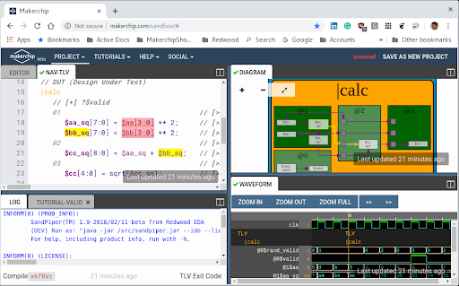

# Introduccion

Primero que nada este resumen proviene del curso de edX ["Building a RISC-V CPU Core"](https://www.edx.org/course/building-a-risc-v-cpu-core), el cual esta bajo una licencia ​[Creative Commons Attribution 4.0 International License​](https://creativecommons.org/licenses/by/4.0/), por lo tanto me encuentro legalmente autorizado a realizar este resumen, y que lo divulgue como desee.

Los cambios realizados a los documentos originales seran traducciones y resumenes de ciertos conceptos.

## Recursos del Curso

Antes de empezar, abre este [repositorio de Github](https://github.com/stevehoover/Gates-To-RISC-V-Course) que contiene todos los recursos externos paar este curso, deberas leer la seccion de Welcome. Cualquier cambio relevante hecho a este curso sera descrito alli.
Te recomendamos anadir la pagina de github a bookmarks o guardar para abrirla durante el curso (de todas formas me encargare de dejar un link al github en la primera linea de todos los capitulos de este resumen/traduccion).

## Makerchip IDE

para empezar el curso nos introducira a [Makerchip IDE](https://www.makerchip.com/), una IDE donde podremos trabajar con disenos de chips. Dejare el video a continuacion.

[video1-makerchip.mp4](src/video1-1.mp4)

[Subtitulos.txt](src/sub1-1.txt)

[Subtitulos.srt](src/sub1-1.srt)

Te recomiendo seguir cada uno de los pasos del video, seran utiles para practicar.

## Lab: Introduccion a Makerchip

Este primer lab te da la oportunidad de jugar con las caracteristicas que tiene [Makerchip IDE](https://makerchip.com/). Tu desafio es tan simple como reproducir la imagen que se aqui abajo (al menos logra algo cercano) siguiendo los pasos que te daremos.

Deberas seguir los pasos a continuacion, en caso de que la plataforma haya sido actualizada busca el mas similar.

1. Open the "Validity Tutorial".
2. Click "Load Pythagorean Example".
3. Split panes and move tabs between panes.
4. Zoom/pan in Diagram with the mouse whell and drag.
5. Zoom Waveform with the "Zoom In" button.
6. Click **$bb_sq** to highlight.

---
|Capitulo Anterior|[Menu Principal](../resumen.md)|[Capitulo Siguiente](2.md)|
|:-:|:-:|:-:|
