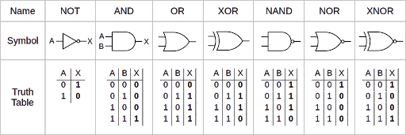
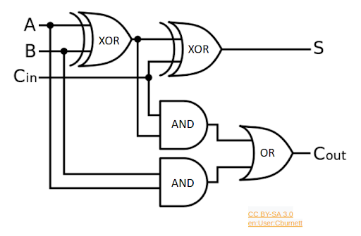
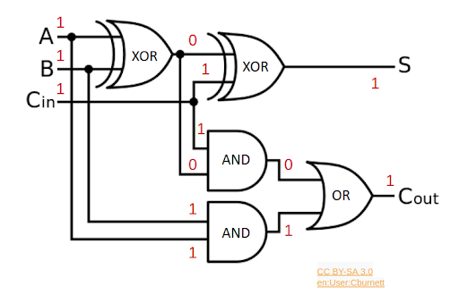

# Logica Combinacional

## Concepto: Puertas Logicas

Si ya te sientes comodo con las puertas logicas, sientete libre de saltar este concepto.

En circuitos digitales, los cables se estabilizan a uno de los dos voltajes: un alto voltaje (VDD) o a un bajo voltaje (VSS or ground). Por lo que, cada cable posee un valor booleano, donde alto y bajo voltaje pueden ser vistos como 1/0, verdadero/falso, true/false, on/off, prendido/apagado, etc. Esto nos entrega un importante grado de abstraccion para componer funciones logicas de mayor orden con un comportamiento predecible.

Las puertas logicas son los bloques basicos de construccion para implementar funciones logicas. La tabla de abajo muestra las puertas logicas basicas. Sus funciones son definidas en "tablas de verdad", las cuales muestran, para cada combinacion (A y B), que valor se obtiene (X). Asegurate de comprender el funcionamiento de cada puerta logica.

||
|:-:|
|**Logic Gates**|

Notas:

- Las puertas **AND** y **OR* siguen el significado de las palabras en Ingles. ("y"/"o" respectivamente.)
- El circulo pequeno (o "burbuja") en las salidas de las puertas logicas quiere decir "inverted", por lo que se obtiene lo opuesto. (es tecnicamente un not.)
- **XOR** y **XNOR** son "exclusive" **OR** y **NOR**, donde "exclusive" quiere decir "no ambos". (Por ejemplo **XOR** Solo sera cierto cuando uno de los dos este activo ***No ambos***.)

Las puertas logicas pueden generar funciones logicas de mayor orden, como el circuito de abajo. (Este circuito Resulta ser conocido como "full adder".)

||
|:-:|
|**Full Adder Circuit**|

Para ciertos valores de input, como se muestra abajo, obtendremos valores de output.

||
|:-:|
|**Example of Boolean Value Propagation through Gates**|

|Capitulo Anterior|[Menu Principal](../2.md)|[Capitulo Siguiente](2.md)|
|:-:|:-:|:-:|
