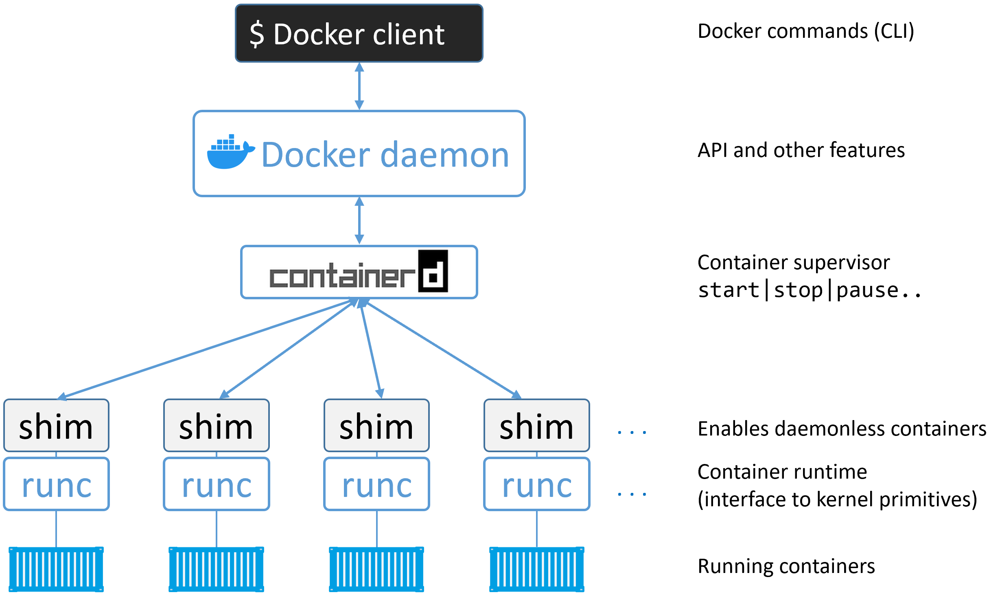

# Docker Engine

En este capitulo daremos un vistaso rapido acerca de Docker Engine.

Esto es completamente opcional, debido a que se puede aprender a usar Docker sin aprender este capitulo.

Sin embargo es extremadamente recomendado en caso que quieras ser un maestro de Docker.

Esto implicara que este capitulo sera completamente teorico, no tendra ejercicios.

Aqui seguiremos el mismo formato del libro original:

1. TLDR
2. Deep Dive
3. Comandos

Por lo tanto ahora, siguiendo el formato del libro original empezamos con la seccion 1.

## Docker Engine - The TLDR

El Docker Engine es el programa central que se encarga de ejecutar y administrar los contenedores. usualmente se le suele referir a el solo como Docker.

Si tu conoces algo acerca de VMware, te sera util pensar que es como ESXi.

El Docker Engine es modular y disenado desde muchas herramientas pequenas y especialazadas.
Siempre que sea posible, estos son basados en estandares abiertos, como son los que son mantenidos por Open Container Initiative (OCI).

En muchas formas, el Docker Engine es como el motor de un auto, ambos son modular y son creados juntando muchas piezas pequenas:

- El motor de auto esta formado por muchas partes especializadas, que todas trabajan juntas para 
que el auto se pueda mover - Colectores de admision, cuerpo de aceleracion, cilindros, bujias, colector de
escape, etc...

- El Docker Engine esta hecho de muchas herramientas especializadas que trabajan juntas para crear y ejecutar
containers - APIs, execution driver, runtimes, shims, etc...

Al momento de leer el libro, los mayores componentes del Docker Engine son:

- El Docker Daemon
- containerd
- runc
- Plugins varios, ya sea de networking o de almacenamiento

Todos estos juntos crean y ejecutan contenedores.

Tanto en el libro como en este resumen nos referiremos a containerd con la "c" minuscula, y a runc con "r" minuscula, esto implicara que los parrafos iniciados con "c" o "r" minuscula seran de forma intencionada.

## Docker Engine - The Deep Dive

Cuando Docker fue lanzado, el Docker Engine tenia dos grandes componentes:

- El Docker daemon (a partir de ahora solo referido como daemon o demonio)
- LXC

El docker daemon era una libreria monolitica, este contenia todo el codigo para el cliente docker, el Docker API, el container runtime, image builds, y mucho mas.

LXC proveia el daemon con acceso a los bloques mas fundamentales de los containers existentes en el kernel de Linux. Cosas como namespaces y control groups (cgroups)

||
|:-:|
|*muestra como el daemon, LXC, y el sistema operativo interactuavan en antiguas versiones de Docker*|

### Deshacerce de LXC

La dependencia sobre LXC fue un problema desde el comienzo.

Primero que todo, LXC es solo Linux. Esto era un problema para un proyecto que aspiraba a ser multi-plataforma.

Segundo, se tan dependiente de una herramienta externa para algo tan central del proyecto, representaba un gran riesgo que pudo impedir el desarrollo.

Como resultado, Docker. Inco. desarrollaron su propia herramienta llamada libcontainer como un remplazo para LXC. El objetivo de libcontainer era una herramiente que funcionaba independientemente de la plataforma, que proveia a Docker con todos los bloques fundamentales de los containers existentes en el kernel.

Libcontainer remplazo LXC como driver de ejecucion default en Docker 0.9.

### deshaciendose del Docker daemon monolitico

con el tiempo, la naturaleza monolitica del Docker daemon se volvieron mas y mas problematicas:

- Era dificil de innovar
- Se volvia cada vez mas lento
- No era lo que ecosistema deseaba

Docker, Inc. estaba al tanto de todos estos desafio lo cual desencadeno en un gran esfuerzo para dividir el daemon monolotico y modularizarlo. El objetivo de todo este esfuerzo es romper el daemon, y re-implementarlo en muchas herramientas pequenas y especializadas. Estas herramientas pueden ser remplazadas, como tambien facilmente re-utilizadas por terceros para hacer otras herramientas. Este plan seguia la filosofia "tried-and-tested" de Unix, en la cual se desarrollan pequenas y especializadas herramientas, que entre todas pueden formar unas mas grandes.

Este trabajo de romper y separar, para reconstruir el Docker Engine, ha provocado que todo el codigo de la ejecucion del container y el container runtime  fueran completamente removidos de daemon, para ser recontruidas en nuevas herramientas.

||
|:-:|
|*shows a high-level view of the current Docker engine architecture with brief descriptions.*|

### La influencia de Open Container Initiative (OCI)

Mientras Docker, Inc. esta dividiendo el daemon y rearmando el codigo, el OCI estaba en proceso de definir dos estandares relacionados a los containers (a.k.a stardards)

1. [Image spec](https://github.com/opencontainers/image-spec)
2. [Container runtime spec](https://github.com/opencontainers/runtime-spec)

Ambas especificaciones fueron lanzadas en Julio del 2017 en la version 1.0, Podemos notar que no implicaron muchos cambios

## Resto

el capitulo era muy largo y poco practico, por lo que no lo resumi, es posible que lo haga en un futuro...

---
|[Capitulo Anterior](1.md)|[Capitulo Siguiente](3.md)|
|:-:|:-:|
