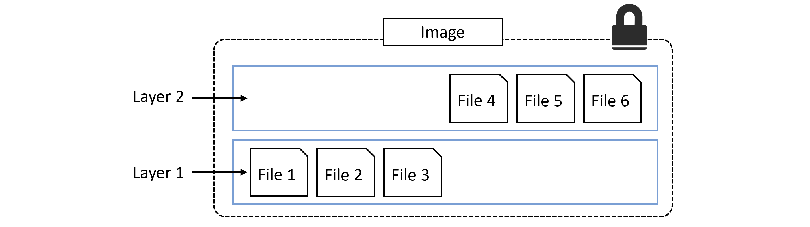

# Imagenes

Las imagenes pueden ser entendidas como un sistema operativo que ha sido parado. Esta es la forma mas facil de comprenderlo, Imagina que has usado una maquina virtual, a la cual le has instalado un sistema linux, una vez ya ha estado lista has parado la ejecucion y has hecho un respaldo.

Si bien esto tiene ciertas contradicciones con el verdadero funcionamiento de las imagenes y docker, sirve para hacerce una idea. A diferencia de una maquina virtual una imagen solo incluye los elementos esenciales de un sistema operativo (y retirando los elementos de kernel), logrando asi que la imagen sea extremadamente liviana y eficiente.

Por ejemplo, la imagen del alpine linux, pesa menos de 5MB!!!

En dockerhub (plataforma oficial de docker para descargar imagenes) existen dos niveles para las imagenes.

Las imagenes en son oficiales son constantemente actualizadas y revisadas por docker, estas son altamente seguras. Se pueden identificar debido a que la imagen tiene su nombre directamente.

Ejemplo:

```shell
alpine
mongo
ubuntu
archlinux
```

Las imagenes no oficiales se pueden identificar debido a que su nombre tiene un prefijo con el nombre del autor, en este formato ```<autor>/<imagen>```

Ejemplo:

```shell
archlinux/base
```

## Comandos

A partir de ahora procedere a explicar los comandos y sus funciones

### docker image pull

```shell
docker image pull <repository>:<tag>
```

Este comando se encargara de descargar una imagen desde el servidor de de docker, es posible visualizar las imagenes en [dockerhub](https://hub.docker.com/)

La mayoria de sistemas (excluyendo los de microsoft) incluyen el 'tag' latest, que permite descargar la ultima imagen disponible al momento.

En caso de que no senales un tag, docker asumira que te estas refiriendo al ultimo, por lo que buscara el latest.

Latest no siempre apuntara a la ultima imagen, por ejemplo, alpine tiene latest y edge, mientras latest se refiere a la ultima imagen estable, edge trae programas que aun no han sido probados.

Para descargar imagenes de repositorios externos debes anteponer el dns repositorio, como es el caso de las imagenes de microsoft. Formato ```docker image pull <dns>/<repository>:<tag>```

Para descargar todas las imagenes de un repositorio se anade el flag ```-a```

#### Ejemplos (image pull)

```shell
docker image pull alpine:latest
docker pull alpine:latest
docker pull alpine:3.13.2
docker pull -a alpine
docker image pull mcr.microsoft.com/powershell:latest
```

### Imagenes Descargadas

Para visualizar las imagenes descargadas se ocupa el comando ```docker image ls``` o lo que seria lo mismo ```docker images```.

Para hacer un filtrado de las imagenes se usa el flag --filter, por ejemplo con ```docker images ls --filter dangling=true```, esto significa que filtrara las imagenes solo para las que tengan ```dangling=true```.

```dangling=true``` significa que las imagenes tiene tag ```<none>:<none>```, esto ocurre cuando al momento de hacer el build de la imagen ya existe una con aquel mismo tag.  quitando el tag de la antigua imagen y asignandosela a la nueva build.

Las opciones para ```--filter``` son:

| Filtro | Uso | Retorna |
|-|-|-|
|dangling | aceptra true or false | retorna todas las imagenes que sean o no dangling |
| before | requiere el nombre o id de una imagen | retornara todas las imagenes creadas antes de esta |
| since | requiere el nombre o id de una imagen | retorna todas las imagenes creadas despues a esta |
| label | requiere una label o una label y un tag | filtra las imagenes segun la presencia de cierto label y tag |

Al igual que como dice el autor, para mas filtros se puede leer la documentacion.

Otro posible flag es el ```--format```, que usando Go templates. El autor recomienda que en caso de requerir un formateo con mas "potencia" se pueden usar herramientas como ```grep``` o ```awk```.

#### Ejemplos (imagenes descargadas)

```shell
docker image ls
docker images
docker images ls --filter dangling=true
docker image ls --filter=reference="*:latest"
docker image ls --format "{{.Size}}"
docker image ls --format "{{.Repository}}: {{.Tag}}: {{.Size}}"
```

### Eliminar Imagenes

Para eliminar imagenes se puede usar el comando ```docker prune```, que eliminara todos los contenedore en estado de dangling.

Para eliminar todas las imagenes que no esten en uso se puede usar anadir la flag ```-a``` (```--all```). Esto quiere decir que eliminara todos los contenedores que no tengan imagenes asociadas.

Para eliminar una imagen en especifico usamos ```docker rmi```.

#### Ejemplos (eliminar imagenes)

```shell
docker image prune
docker image prune -a
docker rmi alpine
```

### Buscar Imagenes de Docker Hub

Para esto se ocupa el comando ```docker search```, el cual buscara imagenes segun su **nombre**. Recordamos que la estructura de los nombres de imagenes puede variar entre ```<NAME>``` y ```<Autor>:<NAME>```.

Para solamente buscar imagenes oficiales o no oficiales se puede utilizar un filtro: ```is-officiel```

Se puede hacer exactamente lo mismo con imagenes con builds automatizadas.

como ultimo detalle, docker search buscara hasta 25 resultados, esto se puede cambiar usando el flag ```--limit```, logrando obtener hasta 100 resultados.

#### Ejemplos (buscar imagenes de docker hub)

```shell
docker search alpine
docker search archlinux
docker search alpine --filter "is-official=true"
docker search micr --limit 100
```

### Imagenes y Layers

Una imagen de docker no es mas que un conjunto de layers read-only (capas de solo lectura) levemente conectadas. Esto se muestra en la siguiente imagen.


Docker se encarga de apilar las layers y representarlas como un objeto unico.

Uno puede pre-visualizar las layers por ejemplo al momento de hacer un pull de la imagen. Donde se descargara cada layer por separado.


Cada linea del pull que terminan con "Pull complete" representa que una layer ha sido descargada.


Otra forma de inspeccionar las imagenes es con el comando ```docker image inspect <image>```

Las imagenes mostraran las layers junto a los hashes correspondientes a cada layer.

otra forma de inspeccionar imagenes es usar ```docker history <image>```, este no muestras explicitamente las layers, sino las instrucciones del Dockerfile (“ENV”, “EXPOSE”, “CMD”, and “ENTRYPOINT”) que anaden metadata y no resultan en creacion de layers permanentes.

Todas las imagenes docker empiezan con una layer base, y a medida que nuevo contenido es anadido, nuevas layers van siendo creadas encima.

ejemplo del libro (es muy simplificado):

"Considera que deseas crear una imagen python. Tu podrias tener una politica corporativa donde todas las aplicaciones deben estar basadas en una imagen de ubuntu 20:04. Si tu deseas anadir el paquete de Python, este debe debe ser anadido como una segunda layer sobre la layer base. Si tu mas tarde deseas anadir codigo fuente, este podria se anadido en una layer adicional. Tu imagen final tendra tres layers como se mostrara en la siguiente Imagen (recuerda que este es un ejemplo que ha sido muy simplificado para efectos educativos)."


Es importante comprender que a medida que las layer son anadidas, la imagen siempre es una combinacion de todas las layers apiladas en orden desde el cual son anadidas. En el siguiente ejemplo se ven 2 layers con 3 archivos cada una. Pero la imagen tiene un total de 6.

||
|:-:|
|*El autor explica que en la imagen 6.6 se muestran las layers de una forma distinta a las imagenes anteriores, con el objetivo de explicar mejor el sistema de ficheros*|

En un ejemplo levemente mas complejo tenemos el presentado en la imagen 6.7, el cual tiene 3 layers, Donde la imagen final presenta 6 archivos, mientas que la suma de los archivos de cada layer tiene 7. Esto debido a que el "File 7" en la layer superior, es una version actualizada del "File 5", el cual esta directamente debajo (misma linea). En esta situacion, el archivo en la layer superior "oscurese" (treduccion literal de obscures, si alguien sabe la palabra correcta lo cambia) el archivo directamente abajo de el. Esto permite actualizar archivos y anadirlos en capas superiores.


Docker emplea un driver de almacenamiento (storage driver) que es responsable de apilar las layers y presentarlas como un sistema unico de ficheros/imagen. Ejemplos de storage drivers para linux son: AUFS, overlay2, devicemapper, btrfs, y zfs. Como los nombres indican, cada uno es basado en sistema de fichero de linux or un tecnologia block-device, y cada uno tiene sus propias caracteristicas y performance. El unico driver soportado por docker en windows en *widowsfilter*, el cual implementa layering y [CoW](https://en.wikipedia.org/wiki/Copy-on-write) sobre [NTFS](https://en.wikipedia.org/wiki/NTFS). (como opinion personal mia, si quieres ver un poco mas CoW te recomendaria investigar un poco de btrfs, el cualtiene el CoW como una de sus caracteristicas principales)

No importa que storage driver es usado, la experiencia de cara al usuario es siempre la misma.

||
|:-:|
|*La Figure 6.8 muestra la misma imagen de 3 layers que hemos visto antes, solo que ahora fusionada, entregando una vista unificada.*|

### Comparticion de layers

me falta redactar

---
|[Capitulo Anterior](2.md)|[Menu Principal](../resumen.md)|[Capitulo Siguiente](4.md)|
|:-:|:-:|:-:|
